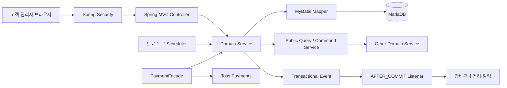

# cakeshop

오프라인 케이크 매장의 상품 탐색부터 주문·결제, 회원, 커뮤니티, 후기와 관리자 운영까지 하나의 흐름으로 구현한 Spring Boot 팀 프로젝트입니다.

> Java 21 · Spring Boot 4.0.2 · Spring MVC · Thymeleaf · Spring Security · MyBatis · Flyway · MariaDB

이 저장소는 팀 프로젝트 종료 후 제가 담당했던 **주문·결제 영역을 다시 분석하고 개선하는 개인 포트폴리오 저장소**로 관리하고 있습니다.

## 서비스 흐름

```text
상품 탐색 → 옵션·장바구니 → 주문 생성 → Toss 결제 → 픽업·제작 관리
                                      └→ 실패 보상·환불·복구

회원·쿠폰 ─────────────── 주문 금액과 소유권 검증
커뮤니티·후기·채팅·알림 ── 고객 경험과 관리자 운영
```

- 고객: 상품·옵션 조회, 일반/주문 제작 주문, 결제, 쿠폰, 커뮤니티, 후기, 채팅·알림
- 관리자: 상품·재고, 주문 제작·픽업, 회원·콘텐츠, 결제·환불, 통계·대시보드 관리
- 서버: 인증 사용자와 저장된 가격·금액·상태를 기준으로 요청을 다시 검증

## 기여 범위

| 구분 | 범위 | 확인 기준 |
|---|---|---|
| 팀 프로젝트 전체 | 위 고객·관리자 서비스를 팀이 공동 개발 | [`team-project-final`](https://github.com/juhwanz/cakeshop_PV/tree/team-project-final) |
| 팀 프로젝트 개인 담당 | 주문 생성, 일반/주문 제작 결제, 만료·취소·환불·복구 | [주문·결제 사례](docs/order-payment-case-study.md) |
| 프로젝트 종료 후 개인 개선 | 담당 코드를 재분석하고 테스트로 문제를 재현한 뒤 구조·안전성 개선 | 태그 이후 [개인 저장소 이력](https://github.com/juhwanz/cakeshop_PV/compare/team-project-final...main) |

`team-project-final`은 팀 프로젝트 종료 당시의 기준점입니다. 태그 이후 작업은 팀 성과로 섞어 표현하지 않으며, 실제 Issue·Commit·Test로 확인할 수 있는 내용만 기록합니다.

## 아키텍처

cakeshop은 14개 업무 도메인을 한 애플리케이션에 구성한 서버 렌더링 방식의 모듈형 모놀리스입니다. 각 도메인은 수직 슬라이스로 응집하고, 결제처럼 외부 시스템과 내부 상태가 함께 움직이는 흐름은 조정 계층과 트랜잭션 계층을 분리했습니다.



- [모듈형 모놀리스와 수직 슬라이스](docs/architecture-overview.md#모듈형-모놀리스와-수직-슬라이스): 기능 응집도와 팀 담당 경계를 코드 구조에 반영
- [도메인 간 공개 계약](docs/architecture-overview.md#도메인-간-공개-계약): 다른 도메인의 테이블·Mapper·Entity 대신 최소 Query/Command 계약 사용
- [외부 PG와 내부 트랜잭션 분리](docs/architecture-overview.md#외부-pg와-내부-트랜잭션-분리): 긴 DB 트랜잭션 대신 승인 이후 실패를 명시적으로 복구
- [영속 보상과 멱등 복구](docs/architecture-overview.md#영속-보상과-멱등-복구): 취소 의도를 먼저 저장하고 같은 멱등키로 재처리

전체 컴포넌트 경계, 결제 시퀀스, 선택한 대안과 남은 한계는 [아키텍처 개요](docs/architecture-overview.md)에 정리했습니다.

## 주문·결제에서 해결한 문제

### 1. 승인 중 만료되는 결제의 일관성

Toss 승인 요청 직전에는 유효했지만 응답 도착 시 만료된 주문이 완료될 수 있는 경합을 다뤘습니다. 승인 후와 주문 행 잠금 후 만료를 다시 확인하고, 이미 승인된 결제는 영속 보상 취소와 멱등 재시도 흐름으로 연결했습니다.

- 팀 Issue [#207](https://github.com/team-sweethan/cakeshop/issues/207) · PR [#209](https://github.com/team-sweethan/cakeshop/pull/209)

### 2. 주문 제작 선결제의 원자적 상태 전이

주문 제작 결제 성공 시 재고 차감·이력, `Payment.DONE`, `Order.UNDER_REVIEW`, 쿠폰 사용을 한 트랜잭션으로 확정했습니다. 중복 confirm, 만료 경합과 내부 실패에는 기존 보상·복구 경계를 재사용했습니다.

- 팀 Issue [#225](https://github.com/team-sweethan/cakeshop/issues/225) · PR [#229](https://github.com/team-sweethan/cakeshop/pull/229)

### 3. Checkout과 주문 생성의 검증 일치

팀 프로젝트 종료 후 주문서 조회와 주문 생성에 중복된 상품·수량·재고·옵션·금액 검증을 공통화했습니다. 조회에서는 통과하지만 제출에서 실패하던 무제한 재고 수량과 0원 주문의 검증 시점을 일치시켰습니다.

- 개인 Issue [#1](https://github.com/juhwanz/cakeshop_PV/issues/1) · PR [#2](https://github.com/juhwanz/cakeshop_PV/pull/2) · Commit [`73c961c1`](https://github.com/juhwanz/cakeshop_PV/commit/73c961c1d3273125e52498bea41cd905bdcbbf85)

설계 선택, 실패 시나리오와 당시 검증 범위는 [주문·결제 문제 해결 기록](docs/order-payment-case-study.md)에 정리했습니다.

## 검증 전략

- 브라우저 금액을 신뢰하지 않고 서버 데이터로 주문 금액 재계산
- Order와 Payment 상태를 분리하고 재고·결제·주문 전이를 단일 트랜잭션으로 확정
- Service 단위 테스트로 상태 전이와 실패 분기 검증
- MockMvc로 인증·인가와 HTTP 경계 검증
- MariaDB Testcontainers로 트랜잭션 rollback, 행 잠금과 경합 검증
- MockWebServer로 Toss 요청·응답과 재시도 경계 검증

```bash
./gradlew unitTest      # MariaDB Testcontainers 제외
./gradlew mariaDbTest   # MariaDB 통합 테스트
```

정확한 테스트 선택 기준은 [테스트 가이드](docs/testing.md)를 따릅니다.

## 안전한 로컬 실행

기본 프로필은 없습니다. 실행 환경을 명시하지 않으면 애플리케이션이 시작 단계에서 실패합니다.

```bash
cp .env_sample .env
./gradlew bootRun --args="--spring.profiles.active=local"
```

`local`은 로컬 MariaDB와 로컬 파일 저장소만 사용하며 Toss·SMTP·SMS·S3·OAuth 실제 호출을 활성화하지 않습니다. 일부 조회 화면을 익명으로 시연하려면 외부 호출과 예약 작업이 꺼지는 `local,preview`를 사용합니다.

Toss 테스트 API는 `local,toss-test`에서만 명시적으로 활성화되며 `test_ck_`/`test_gck_`와 `test_sk_`/`test_gsk_` 키 쌍만 허용합니다. 라이브 키는 시작 단계에서 거부합니다.

전체 설치 절차는 [로컬 실행 가이드](docs/getting-started.md), 프로필 조합과 보안 경계는 [환경·보안 가이드](docs/security-environments.md)를 참고하세요.

## 기술 스택

| 영역 | 기술 |
|---|---|
| Backend | Java 21, Spring Boot 4.0.2, Spring MVC |
| View · Security | Thymeleaf, Spring Security, OAuth2 Client |
| Data | MyBatis 4.0.1, MariaDB, Flyway |
| External · Realtime | Toss Payments, AWS SDK v2, SMTP, Solapi, WebSocket |
| Test | JUnit Platform, AssertJ, Mockito, MockMvc, Testcontainers |
| Build · Monitoring | Gradle Wrapper, Actuator, Micrometer Prometheus |

정확한 버전과 의존성은 [`build.gradle`](build.gradle)이 기준입니다.

## 문서 안내

| 독자 | 문서 |
|---|---|
| 프로젝트를 실행하려는 사람 | [로컬 실행 가이드](docs/getting-started.md) |
| 전체 구조와 설계 선택을 확인하는 사람 | [아키텍처 개요](docs/architecture-overview.md) |
| 주문·결제 설계를 평가하려는 사람 | [주문·결제 문제 해결 기록](docs/order-payment-case-study.md) |
| 프로필·외부 연동 경계를 확인하는 사람 | [환경·보안 가이드](docs/security-environments.md) |
| 구조와 협업 규칙을 확인하는 개발자 | [코드 컨벤션](docs/conventions.md) · [PR 가이드](docs/pull-request.md) |
| DB 변경과 테스트 방식을 확인하는 개발자 | [Flyway 가이드](docs/flyway_make_sample.md) · [테스트 가이드](docs/testing.md) |
| 현재 스키마를 확인하는 개발자 | [데이터베이스 스키마](docs/database-schema.md) |

운영 RDS·운영 S3·Toss 웹훅 정책은 아직 이 포트폴리오의 안전한 로컬 실행 범위에 포함하지 않습니다.
