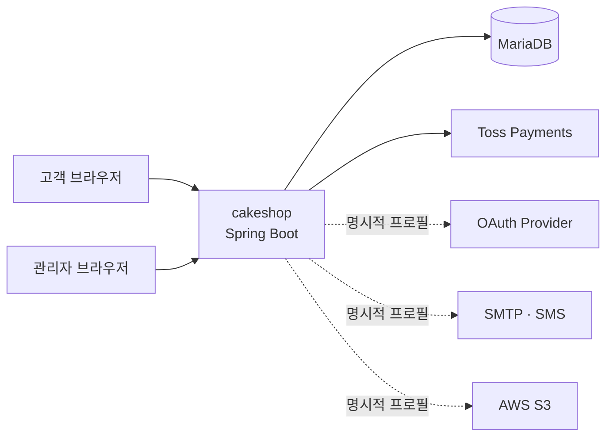
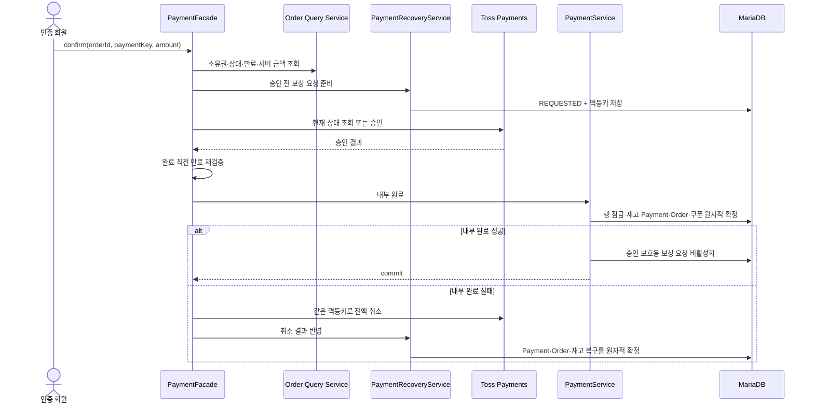

# cakeshop 아키텍처 개요

이 문서는 포트폴리오 평가자가 전체 구조에서 주문·결제가 놓인 위치와 주요 설계 선택을 빠르게 확인하기 위한 지도입니다. 세부 구현 규칙을 새로 정의하지 않으며, 각 결정의 정본과 현재 코드를 연결합니다.

## 범위와 기여 구분

| 구분 | 이 문서에서 다루는 내용 | 근거 |
|---|---|---|
| 팀 공통 구조 | 서버 렌더링 모듈형 모놀리스, 도메인 수직 슬라이스, MyBatis·Flyway·세션 인증 | [팀 프로젝트 종료 기준](https://github.com/juhwanz/cakeshop_PV/tree/team-project-final) |
| 팀 프로젝트 개인 담당 | 주문·결제의 소유권·금액·상태 검증, Toss 승인, 원자적 완료, 취소·환불·복구 | [주문·결제 문제 해결 기록](order-payment-case-study.md) |
| 종료 후 개인 개선 | Checkout 검증 공통화, 실행 프로필과 외부 연동의 fail-fast 안전장치, 포트폴리오 문서화 | [태그 이후 변경](https://github.com/juhwanz/cakeshop_PV/compare/team-project-final...main) |

팀 공통 아키텍처를 개인이 모두 설계한 것으로 표현하지 않습니다. 아래 주문·결제 실행 경계는 개인 담당 구현을 설명하고, 종료 후 개선은 별도 표기로 구분합니다.

## 시스템 컨텍스트



- Spring MVC와 Thymeleaf가 고객·관리자 화면을 서버에서 렌더링하고 Spring Security가 세션 인증과 권한을 강제합니다.
- MariaDB는 주문, 결제, 취소 요청을 포함한 업무 상태를 저장하며 Flyway가 스키마 변경 이력을 관리합니다.
- Toss 승인·조회·취소는 HTTP 경계 밖의 결과를 내부 DB 트랜잭션과 동일하게 rollback할 수 없으므로 별도의 복구 흐름을 둡니다.
- OAuth·SMTP·SMS·S3는 필요한 환경에서만 명시적으로 활성화합니다. `local` 격리 기준은 [환경·보안 가이드](security-environments.md)가 정본입니다.

## 애플리케이션 구조

실제 코드는 `domain/<domain>/{controller,service,mapper,entity,dto,error}`를 기본 단위로 구성합니다. 현재 14개 도메인 디렉터리가 있으며, 아래 묶음은 탐색을 위한 설명일 뿐 새로운 배포 단위나 공식 Aggregate 경계가 아닙니다.

| 관심 영역 | 도메인 |
|---|---|
| 거래 | `product`, `cart`, `order`, `payment`, `coupon`, `store` |
| 회원·상호작용 | `member`, `chat`, `notification` |
| 콘텐츠 | `community`, `review` |
| 운영·진입 화면 | `dashboard`, `statistics`, `home` |

요청 처리의 기본 의존 방향은 `Controller → Service → Mapper → DB`입니다. Controller는 HTTP·View 경계, Service는 인증 사용자·소유권·상태·트랜잭션, Mapper는 SQL과 행 매핑을 담당합니다. Scheduler와 이벤트 Listener도 업무 규칙을 복제하지 않고 공개 Service로 진입합니다.

### 모듈형 모놀리스와 수직 슬라이스

업무 기능을 한 도메인 디렉터리에 모아 변경 범위와 팀 담당을 드러냅니다. 레이어별 최상위 패키지보다 한 기능을 추적하기 쉽고, 독립 서비스보다 한 트랜잭션이 필요한 현재 규모에 맞습니다.

이 구조는 DDD의 도메인 경계와 명시적 계약에서 영향을 받았지만 전술적 DDD 전체를 적용한 것은 아닙니다. MyBatis Entity는 DB 행 매핑 객체이며, 모든 기능을 Aggregate·Value Object·Repository로 모델링하지 않습니다. 선택 이유, 대안과 재검토 조건은 [도메인 중심 수직 슬라이스 ADR](decisions/domain-oriented-architecture.md)에 기록했습니다.

감수한 비용은 간단한 조회에도 계약 DTO가 늘 수 있고, 경계를 잘못 나누면 조립 코드가 반복된다는 점입니다. 도메인별 독립 배포나 데이터 저장소 분리가 필요해지면 현재 모놀리스 경계를 다시 검토해야 합니다.

### 도메인 간 공개 계약

도메인은 다른 도메인의 테이블·Mapper·Entity를 직접 사용하지 않고 데이터 소유 도메인이 공개한 `QueryService`·`CommandService`와 최소 DTO를 사용합니다.

```text
payment.PaymentService
  ├─ order.OrderPaymentCommandService
  ├─ coupon.CouponOrderCommandService
  └─ product.ProductStockService
```

이 방식은 주문 상태 규칙을 payment에서 다시 구현하거나, payment SQL이 다른 도메인의 스키마 변경에 직접 결합되는 것을 줄입니다. 반면 계약과 변환 코드가 추가됩니다. 여러 도메인의 집계가 본질인 `dashboard`·`statistics`만 검토와 테스트를 전제로 ReadModel 예외를 허용합니다. 정확한 협업 기준은 [도메인 경계와 연동 규칙](conventions.md#12-도메인-경계와-연동)이 정본입니다.

트랜잭션이 성공한 뒤에만 실행해야 하는 후속 작업은 `AFTER_COMMIT` 이벤트로 분리합니다. 일반 결제 완료 뒤 장바구니 정리와 알림이 그 예입니다. 결제 rollback 시 후속 작업이 실행되지 않는 장점이 있지만, 현재 장바구니 정리 실패는 경고 로그만 남고 영속 재시도하지 않는 한계가 있습니다.

## 주문·결제 실행 경계

### 정상 승인과 내부 실패 시퀀스



브라우저의 회원 ID·금액·상태를 신뢰하지 않습니다. 인증 주체와 주문 소유권을 확인하고, 저장된 상품·옵션·쿠폰을 기준으로 서버 금액을 계산한 뒤 요청 금액과 대조합니다. `Order`는 주문 수명주기, `Payment`는 PG 처리 상태를 각각 소유합니다.

### 외부 PG와 내부 트랜잭션 분리

`PaymentFacade`는 confirm 순서를 조정하지만 클래스 전체를 DB 트랜잭션으로 묶지 않습니다. Toss 조회·승인은 외부 네트워크 호출로 실행하고, 승인 후 재고 차감·결제 완료·주문 전이·쿠폰 사용은 `PaymentService`의 짧은 트랜잭션에서 확정합니다.

외부 호출을 DB 트랜잭션 안에 포함하면 네트워크 지연 동안 잠금이 길어지고, DB rollback만으로 이미 끝난 PG 승인을 되돌릴 수도 없습니다. 분리의 대가는 승인 성공과 내부 실패 사이의 불일치 가능성이므로, 이를 영속 보상으로 명시적으로 다룹니다.

### 영속 보상과 멱등 복구

새 승인을 요청하기 전에 `PaymentCancellation.REQUESTED`와 고정 보상 멱등키를 저장합니다. 내부 완료가 실패하면 Toss 취소를 시도하고, 성공 결과를 결제·주문·재고 상태에 한 트랜잭션으로 반영합니다. timeout이나 서버 재시작으로 완료하지 못한 요청은 스케줄러가 PG 상태를 다시 확인하고 같은 멱등키로 재처리합니다.

이 선택은 단순 try/catch보다 상태와 재시도 근거를 남기지만, 보상 상태 모델·조회·스케줄러를 운영해야 하는 복잡성이 추가됩니다. 정상 결제, 보상 취소, 고객·관리자 환불의 의도와 멱등키를 구분해 재시도가 다른 요청으로 바뀌지 않게 합니다.

## 주요 결정과 트레이드오프

| 문제·불변식 | 선택 | 검토한 대안 | 감수한 비용 | 근거 |
|---|---|---|---|---|
| 기능과 담당 경계를 함께 드러내기 | 도메인 수직 슬라이스 모놀리스 | 레이어별 패키지, 전면 전술적 DDD, 즉시 서비스 분리 | 공개 계약·DTO와 조립 코드 증가 | [아키텍처 ADR](decisions/domain-oriented-architecture.md) |
| 다른 도메인의 규칙 우회 방지 | 공개 Query/Command Service | 직접 JOIN·Mapper·Entity 공유 | 호출 계약 관리 필요 | [연동 규칙](conventions.md#12-도메인-경계와-연동) |
| PG 지연 중 DB 잠금과 부분 성공 관리 | 비트랜잭션 Facade + 트랜잭션 Service | 외부 호출까지 하나의 DB 트랜잭션 | 보상 흐름 필요 | [`PaymentFacade`](../src/main/java/com/cakeshop/domain/payment/service/PaymentFacade.java) · [`PaymentService`](../src/main/java/com/cakeshop/domain/payment/service/PaymentService.java) |
| 승인 후 내부 실패 복구 | 승인 전 영속 요청 + 멱등 취소·재처리 | 메모리 재시도, 실패 로그만 기록 | 상태·스케줄러 복잡성 | [`PaymentRecoveryService`](../src/main/java/com/cakeshop/domain/payment/service/PaymentRecoveryService.java) |
| 결제 rollback과 후속 정리 분리 | `AFTER_COMMIT` 이벤트 | 결제 트랜잭션 안에서 직접 정리 | 후속 작업 재시도 정책 필요 | [주문·장바구니 연동](order/README.md#결제-완료-후-장바구니-정리) |
| 안전하지 않은 환경 오기동 방지 | 명시적 프로필 + 시작 단계 검증 | 암묵적 기본 프로필 | 실행 시 프로필 선택 필요 | [환경·보안 가이드](security-environments.md) |

## 검증 구조

| 위험 | 검증 계층 |
|---|---|
| 금액·소유권·허용 상태와 실패 분기 | Service 단위 테스트 |
| 인증·인가와 요청·응답 계약 | MockMvc 슬라이스 테스트 |
| SQL, rollback, 행 잠금과 만료 경합 | MariaDB Testcontainers 통합 테스트 |
| Toss 승인·조회·취소 요청과 timeout | MockWebServer 기반 클라이언트·Facade 테스트 |
| 프로필 조합과 라이브 키 차단 | 시작 정책 단위 테스트와 실제 boot smoke test |

빠른 검증은 `./gradlew unitTest`, DB 경계 검증은 `./gradlew mariaDbTest`로 분리합니다. 테스트 선택과 중복 기준은 [테스트 가이드](testing.md)를 따릅니다.

## 현재 한계와 범위 밖

- 애플리케이션은 단일 배포 단위와 공유 MariaDB를 사용하는 모놀리스입니다. 도메인별 독립 장애 격리와 배포는 제공하지 않습니다.
- DDD의 일부 개념을 선택적으로 사용하며, 전체 코드를 Aggregate 중심 모델로 전환하지 않았습니다.
- 도메인 경계 원칙 도입 전 코드가 모두 정리됐다고 보장하지 않습니다. 확인된 예외는 계약으로 옮기고, 남은 예외는 발견 시 별도 개선합니다.
- 일반 결제의 `AFTER_COMMIT` 장바구니 정리는 멱등이지만, 실패 이력 저장과 영속 재시도는 아직 없습니다.
- 실제 Toss 결제창을 포함한 브라우저 E2E와 운영 장애 복구 훈련 결과는 현재 저장소가 제공하는 자동 검증 범위에 포함되지 않습니다.
- 운영 RDS·운영 S3·Toss 웹훅 정책과 운영 SLO는 이번 포트폴리오·로컬 실행 개편 범위 밖입니다.

## 더 깊게 볼 문서와 코드

- 담당 문제와 결과: [주문·결제 문제 해결 기록](order-payment-case-study.md)
- 전체 구조 결정: [도메인 중심 수직 슬라이스 ADR](decisions/domain-oriented-architecture.md)
- 인증 결정: [세션 인증 ADR](decisions/session-authentication.md)
- DB 변경 결정: [Flyway ADR](decisions/flyway-migrations.md)
- 결제 조정과 보상: [`PaymentFacade`](../src/main/java/com/cakeshop/domain/payment/service/PaymentFacade.java) · [`PaymentCompensationProcessor`](../src/main/java/com/cakeshop/domain/payment/service/PaymentCompensationProcessor.java)
- 내부 완료와 복구: [`PaymentService`](../src/main/java/com/cakeshop/domain/payment/service/PaymentService.java) · [`PaymentRecoveryService`](../src/main/java/com/cakeshop/domain/payment/service/PaymentRecoveryService.java)
